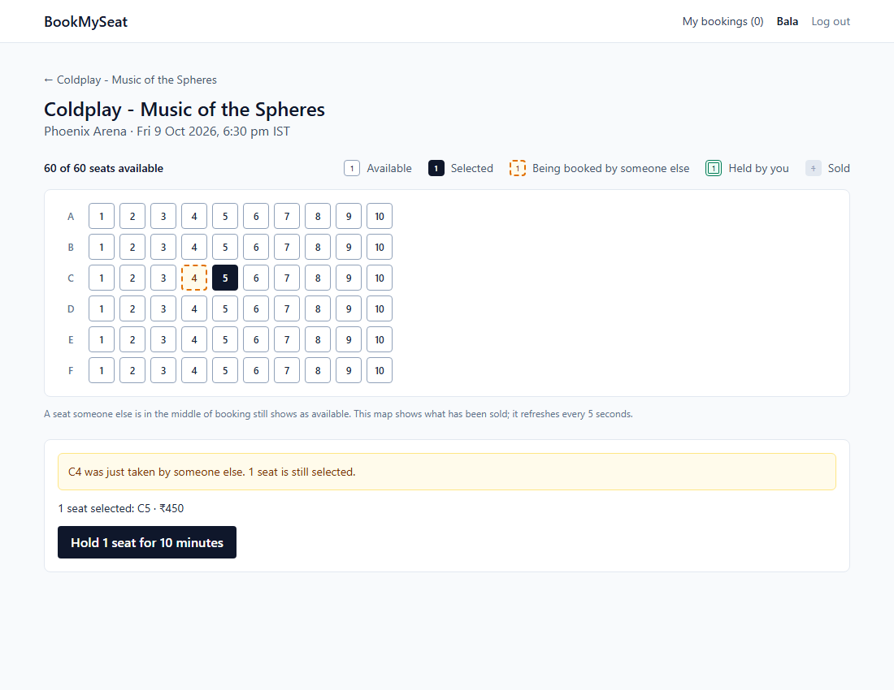
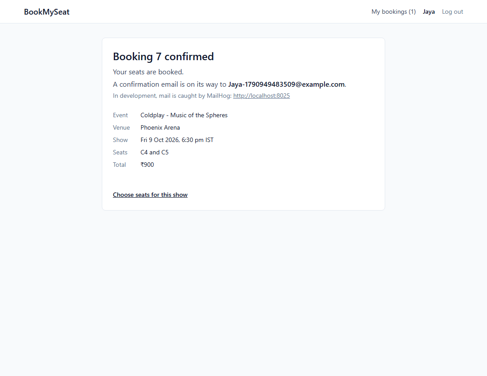
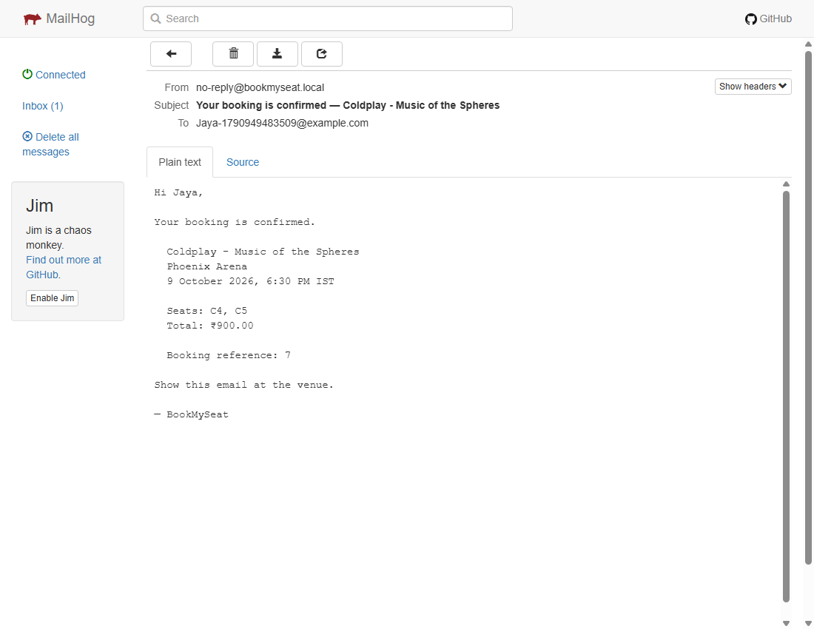

# BookMySeat

[](https://github.com/Arshad-327/BookMySeat/actions/workflows/ci.yml)

An event-ticketing platform built around one problem: **two people must never be able to book the same seat.**

The first version got that wrong, measurably. 50 requests for one seat, released within 2 ms of each other, produced **10 bookings for that seat**. After moving the claim into an atomic Redis hold, the same 50 requests, released within 0 ms, produced **exactly 1**. Both runs measured the spread between requests, to prove they collided rather than queued. The verbatim output, the database rows and the commit each run was taken from are in [docs/load-test-results.md](docs/load-test-results.md).

```
docker compose up -d --build --wait
```

Then open **http://localhost:5173**. Confirmation emails land in MailHog at http://localhost:8025.

---

## What losing the race looks like

Two users pick seat C4. One holds it. This is the other one's screen:



C4 is marked, their other seat is still selected, and nothing they held was lost, because nothing was held: a hold is all seats or none.

One thing the seat map does not do is show held seats. Until a hold is confirmed, the seat reads as available to everyone else, and they find out by trying. That is deliberate: a hold is a Redis key that expires by itself in ten minutes, and it is never written to the database. The map shows what has been **sold**, and re-reads it every five seconds.

## The three layers

Each layer exists because the one before it can fail.

| Layer | Where | What it stops |
|---|---|---|
| 1. Hold | Redis, one key per seat, taken by an atomic Lua script | A crowd contending for a seat. One request gets the hold; the rest are refused in one round trip. This is the layer the measurement above is about. |
| 2. Version check | event-service, `@Version` on the seat row | Two confirms marking the same seat sold, if a hold was lost or expired mid-checkout. |
| 3. Unique index | booking-service's database | A second confirmed booking for a seat, by any code path at all. |

Layer 1 is fast and can be wrong: Redis can lose a key. Layers 2 and 3 are what make a double sale impossible rather than unlikely. [docs/concurrency-design.md](docs/concurrency-design.md) has the reasoning, including why the hold is not a database lock.

A second test covers what one seat cannot: twenty pairs of users asking for overlapping sets of seats. In all 20 pairs exactly one user ended up holding their complete set and the other held nothing.

## From a hold to an email



Confirming a booking writes an event to an outbox table in the same transaction. A publisher sends it to Kafka; notification-service consumes it and sends the email.



That email is the visible end of the outbox, the topic and the consumer. [docs/notification-design.md](docs/notification-design.md) covers the order it works in (check, send, then mark) and why a duplicate email is the failure it chooses over a lost one.

## Running it

You need Docker with a Compose recent enough to support `include` (it was run with Compose 5.2.0 on Docker 29.6.1). Nothing else: no Java, no Node.

```
docker compose up -d --build --wait
```

| URL | What |
|---|---|
| http://localhost:5173 | The app. Register, pick a show, hold seats, confirm. |
| http://localhost:8025 | MailHog. Every confirmation email. |
| http://localhost:8080 | The API gateway. |

- **The first build takes a few minutes.** It was measured at 304 seconds on the development machine with an empty build cache; a restart of an already-built stack took 32 seconds. The ten containers used about 2.3 GB of memory.
- **The demo data goes stale.** Seeded shows are 7, 14 and 21 days out, and the browse page lists only events with an upcoming show. A stack first started more than three weeks ago shows an empty browse page. Start again from nothing with `docker compose down -v`, then the `up` command.
- **To see the race yourself,** open the app in two browser profiles, register a user in each, and have both select the same seat before either clicks Hold.

To develop against it instead, run only the infrastructure (`docker compose -f docker-compose.infra.yml up -d`) and start the services from an IDE; `frontend/README.md` covers the frontend.

## Architecture

Five services, each with its own database where it has one. No service reads another's tables.

| Service | Owns |
|---|---|
| **api-gateway** | The one public entry point. Routing, CORS, rate limiting per client IP, and JWT validation. It strips any `X-User-*` header a client sends and sets them from the token. |
| **auth-service** | Users, passwords, access tokens, rotating refresh tokens. |
| **event-service** | Venues, events, shows, and the seat map. Layer 2 lives here. |
| **booking-service** | Holds, bookings, the outbox. Layers 1 and 3 live here. |
| **notification-service** | Consumes `booking.confirmed` and sends the email. It has no API. |

Only the gateway and the frontend are published to the host. booking-service and event-service trust the `X-User-Id` header, which is safe only while the gateway is the one way to reach them, so their ports are never published. `scripts/check-compose-ports.sh` fails the build if that changes, and CI runs it.

## Tests

- **246 backend tests** across the five modules. The ones that matter run against real MySQL, Redis and Kafka through Testcontainers, not mocks: the guarantees being tested are enforced by those systems.
- **88 frontend tests** on the logic that can be wrong: seat selection, checkout decisions, error classification. Each was checked by breaking the code it covers and confirming it failed.
- **CI** runs both suites and the port check on every push to `main`.
- `scripts/e2e-smoke.sh` walks the whole journey through the gateway in 13 steps. It is run by hand, and needs Java and a built event-service jar on the host as well as the running stack.

## Tech stack

- Java 21, Spring Boot 3.3, Maven multi-module
- Spring Cloud Gateway (WebFlux)
- MySQL 8.4, one schema per service, Flyway migrations
- Redis 7: seat holds, idempotency keys, rate-limit counters
- Kafka (KRaft), one topic, published through a transactional outbox
- React 18, TypeScript, Vite, React Router, TanStack Query, Tailwind
- Testcontainers, k6, Vitest
- Docker Compose, GitHub Actions

## Documents

| Document | Open it for |
|---|---|
| [load-test-results.md](docs/load-test-results.md) | The measurements: 10 bookings becoming 1, with k6 output, database rows and commit hashes. |
| [concurrency-design.md](docs/concurrency-design.md) | Why three layers, and what each one is for. |
| [compensation-ordering.md](docs/compensation-ordering.md) | What happens when a confirm half-succeeds, and why cancel and the expiry sweeper release seats differently. |
| [notification-design.md](docs/notification-design.md) | How a confirmed booking becomes one email: idempotency, retries, and what is dropped. |
| [review-2026-09-18.md](docs/review-2026-09-18.md) | A review of the backend before the frontend existed. Twelve findings, each then fixed or deliberately deferred. |

## What it does not do

- **There is no payment.** Confirming a booking is the sale.
- **Held seats look available** to other users until they are sold. Covered above; it is the design, and it means a click can be refused.
- **Nothing is ever pruned.** Published outbox rows, revoked refresh tokens, and expired or cancelled bookings all accumulate.
- **The expiry sweeper and the outbox publisher assume a single instance** of booking-service.
- **There is no dead-letter topic.** A notification that can never be delivered is logged and dropped.
- **Admin writes are create-only.** Venues, events and shows cannot be edited or deleted, and there is no admin screen.
- **The seat map is not paginated.** Every seat is in every response, and the page re-reads it every five seconds. Measured at 4,897 bytes for 60 seats and 1,667,552 bytes for 20,000.
- **The browse list cannot be sorted by show date.**
- **If Kafka is down when booking-service starts, the topic is never created** until booking-service is restarted. Confirmed bookings are not lost, since the outbox holds them, but no email is sent in the meantime. The compose file waits for Kafka, so this does not happen in a normal start.
- **The rate limiter counts per client IP,** and inside Docker every browser on the host reaches the gateway from the same bridge address. The demo therefore exercises one shared budget.
- **Two browser tabs can race** on the rotating refresh token, and one may be signed out.
- **The frontend has no browser tests.** Its pages were checked by hand.

## How this was built

The code was written with Claude Code, from prompts and under review; the commits say so. Every change was specified, read and approved before it landed, and I can account for any decision in this repository.

The method is the part worth describing. A bug was reproduced before it was fixed, so the fix could be seen to work: the double booking was measured before the hold existed, and tests were watched failing before the change that made them pass. Claims came with the command that produced them. Where something could not be verified, the commit says that too.
